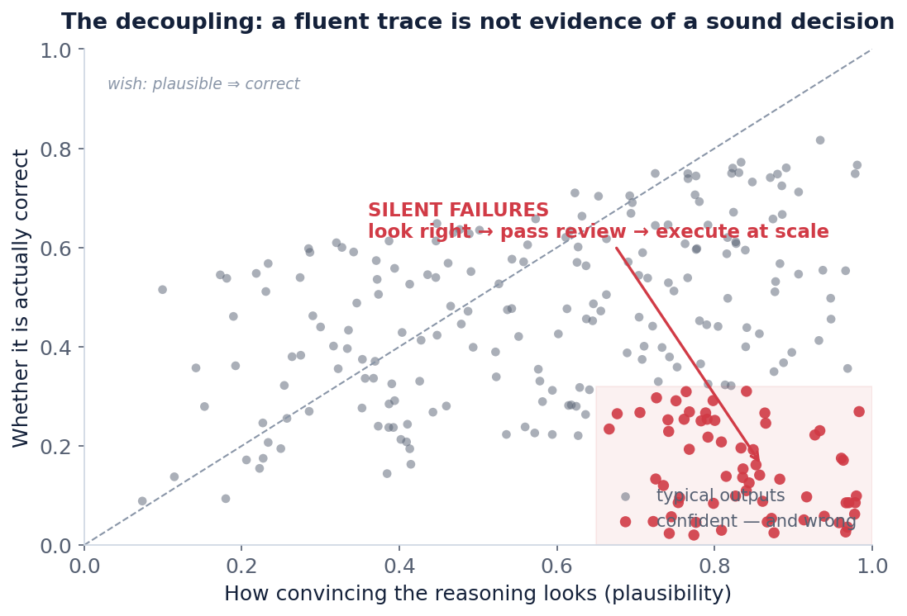
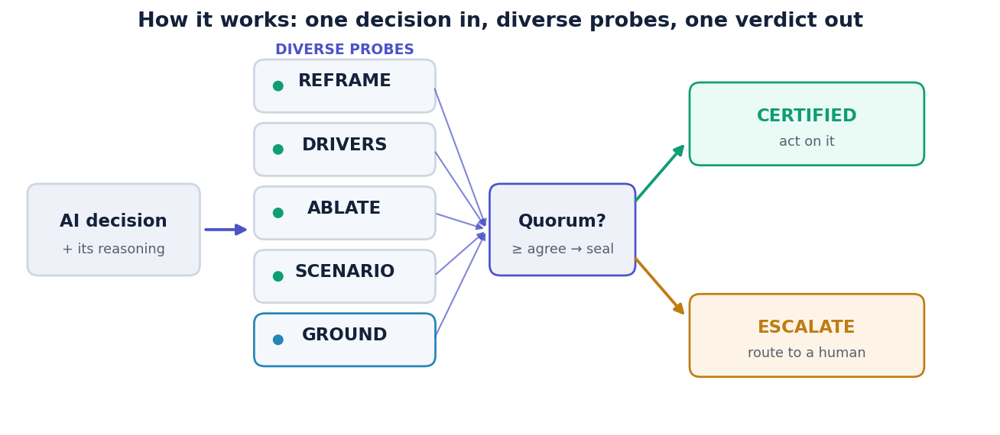
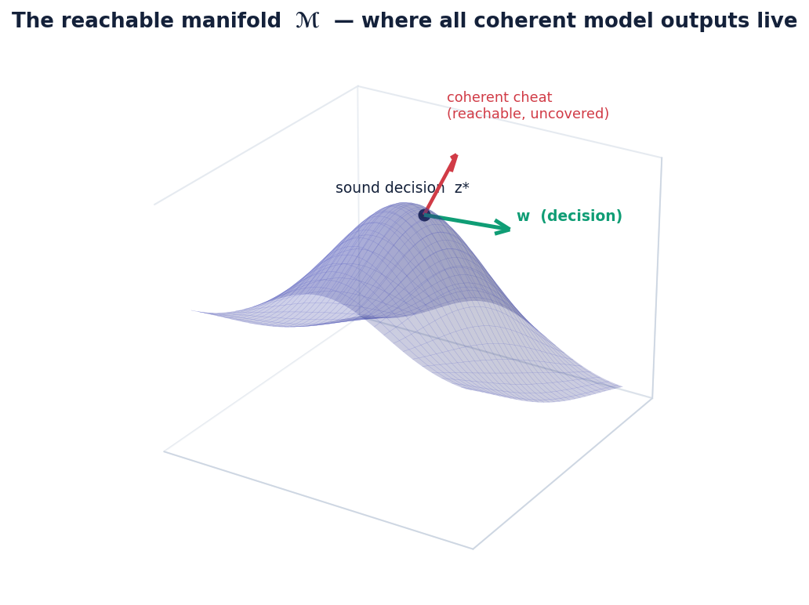
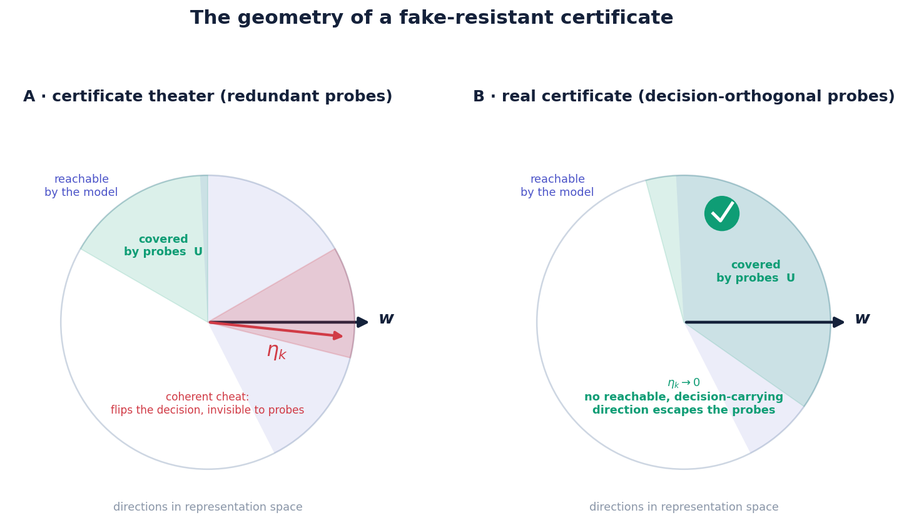
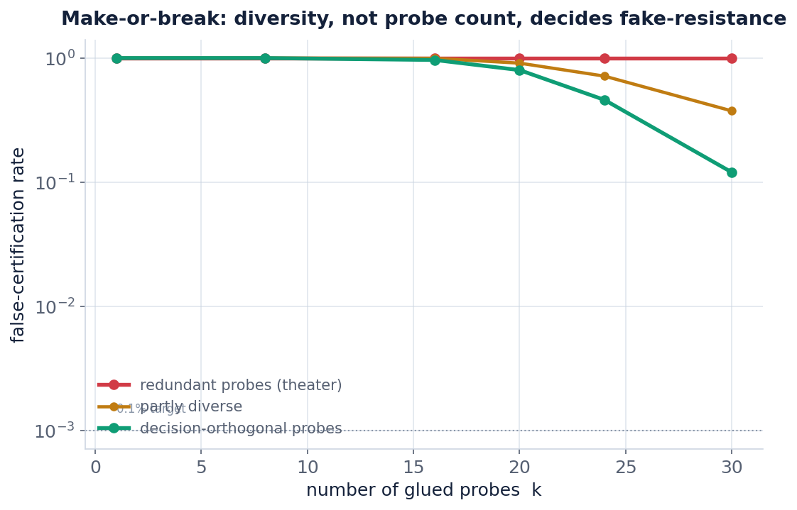
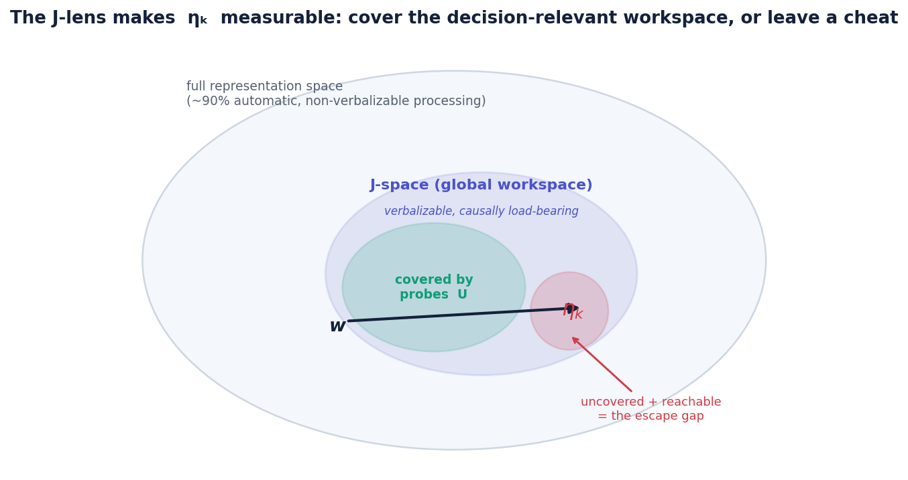

<!--
  White-background post. Rendered with any default light theme (GitHub, dev.to,
  Jekyll minima, Hashnode, Medium import) the page is white. Figures are rendered
  on white to match. Math uses $…$ / $$…$$ (KaTeX/MathJax on most platforms;
  GitHub renders it natively).
-->

# When Is a Reasoning Certificate Expensive to Fake?

*The Reasoning-Certificate Problem and the Gluing-Amplification Conjecture.*

**Suyash Mishra · independent research · open for proof or refutation**

---

> **The argument in five lines**
>
> - In high-stakes use, a **confident, fluent, wrong** answer is the expensive failure: it passes human review and executes at scale.
> - Guardrails filter words; evaluators score answers. Neither **certifies the decision**, and stacking similar checks manufactures false confidence.
> - A certificate should be **glued from many independent probes plus one external anchor**, so faking all of them at once is superadditively hard.
> - Whether that works reduces to one geometric quantity, the **escape gap** $\eta_k$: decision-relevant directions the model can reach but the probes miss.
> - Recent global-workspace interpretability (the **Jacobian lens**) makes $\eta_k$ measurable on real models — turning a worry into an experiment.

---

## 1. Four failures, one shape

Four recent, independent results rhyme in a way worth taking seriously.

Reasoning traces that *look* more insightful can correlate with **lower** conditional accuracy. Natural-language explanations a model gives for its decisions can diverge from the features that actually drive those decisions. A model's out-of-distribution score on one benchmark can fail to predict its out-of-distribution score on another. And giving a model tools can raise the accuracy of its final answers while the underlying reasoning process silently degrades.

State them together and one shape appears. In each case there is an **observable signal** — trace, explanation, benchmark score, tool-checked answer — that we read cheaply and treat as evidence of reasoning competence. And in each case that signal comes apart from the thing it is supposed to measure. Sometimes by accident; sometimes, under optimization pressure, adversarially.

Call the general object these results circle the **Reasoning-Certificate Problem**: *there is no validated, decision-time observable that certifies reasoning, because every cheap signal is decoupled — sometimes adversarially — from the latent competence it is presumed to measure.* This makes both evaluation and optimization ill-posed: if the signal can be satisfied without the competence, then measuring it, or training against it, chases the signal and not the thing.

## 2. Why the obvious fixes don't close it

Two mature tool families look adjacent but solve different problems. **Guardrails** (content filters, PII and injection detectors) block bad *words* at runtime; they do not judge whether a decision's reasoning is sound. **Evaluators** score an answer against a reference or retrieved context; superb when a reference exists, but many consequential decisions have no answer key to grade against.

So teams reach for the natural reflex: *add more checks.* Here is the trap. If the checks are similar, they share blind spots — they all miss the same failure — and stacking them mostly manufactures **false confidence**, which is worse than no check at all, because now the failure carries a seal.

> **The core hazard.** A certificate that looks rigorous but is composed of correlated checks is **certificate theater**. It raises the price of an honest mistake by exactly zero and lowers your guard.

## 3. The reframe: a quorum of independent witnesses

Consider the anti-counterfeit hologram on a passport. Any single security feature is forgeable. What makes the document hard to fake is that you must forge **many independent features at once, consistently**. The security is not in any one check; it is in the *joint*.

Quorum applies this to decisions. Attach several genuinely different, independent probes to a model's decision — including at least one tied to a **verifiable external fact** — and issue a "certified" seal only when a quorum of them agree. Any one probe is weak and gameable. The bet is that faking all of them *coherently* is exponentially harder than faking any one.

Five probe families, chosen to view the decision from different angles:

- **Reframe** — does the decision survive rewording that preserves meaning?
- **Drivers** — do the reasons the model states match the features that actually move it?
- **Ablate** — is each load-bearing step actually load-bearing (remove it and the answer should change)?
- **Scenario** — does the decision hold across structurally similar situations?
- **Ground** — does it match a check tied to the outside world (the external anchor)?

The output is not "more accurate AI." It is **calibrated abstention**: every decision returns **Certified** (act on it) or **Escalate** (a human should look). The product turns silent errors into flagged escalations.

## 4. The geometry that decides everything

To reason about "hard to fake" we need a picture. Represent the model's internal state as a point in a high-dimensional space. Two facts about that space do the work.

First, the model cannot produce arbitrary states. Coherent outputs live on a **low-dimensional reachable manifold** $\mathcal{M}$ — a curved surface inside the vast ambient space. A faker does not get to move anywhere; a fake must stay *on* $\mathcal{M}$, or it isn't something the model would actually output.

Second, a certificate's probes only "see" certain directions — call their union the **covered subspace** $\mathcal{U}$. A corruption breaks the certificate if and only if it does three things at once:

1. **Stays on the reachable manifold** $\mathcal{M}$ (to first order, $\delta \in T\mathcal{M}$);
2. **Carries weight along the decision direction** $w$, so it actually flips the outcome ($\langle w, \delta\rangle \neq 0$);
3. **Lies outside** $\mathcal{U}$, so no probe fires ($\delta \in \mathcal{U}^{\perp}$).

The set of moves satisfying all three is the **escape gap**, and its size is the one number that matters:

$$
\eta_k \;=\; \big\lVert\, \Pi_{T\mathcal{M}\,\cap\,\mathcal{U}^{\perp}}\; w \,\big\rVert.
$$

If $\eta_k \to 0$, no reachable, decision-carrying corruption can evade the probes: the certificate is fake-resistant. If $\eta_k$ stays bounded away from $0$, a coherent cheat exists.

The picture also tells you *which* probes help. Adding a probe that covers directions you already cover does nothing to $\eta_k$. Adding a probe that covers a **new, decision-relevant** direction shrinks it. This is the difference between redundant and **decision-orthogonal** probes — and it is the whole game.

## 5. What can be proved

In a tractable linear–Gaussian model — where $\mathcal{M}$, $w$, and the probes are all explicit — three results hold. Each is stated in plain language first, then precisely.

**Result 1 — Grounding is necessary.**
*Plain:* a certificate built only from the model checking itself for consistency can always be fooled, no matter how many self-checks you add. You need at least one probe anchored outside the model.
*Precise:* purely internal self-consistency probes share a common null space aligned with the decision direction; false-certification does not decay with $k$ unless an external anchor breaks that alignment.

**Result 2 — Make-or-break.**
*Plain:* if your probes are genuinely different (decision-orthogonal), the chance a fake slips through drops faster than any polynomial as you add probes. If they're redundant, it flatlines at a positive floor forever.
*Precise:* under decision-orthogonality the false-certification rate is super-polynomially small in $k$; under redundancy it is bounded below by a constant independent of $k$.

**Result 3 — An unconditional query lower bound.**
*Plain:* an adversary who can only probe the system by sampling it — no privileged access — needs an exponential number of tries to forge a diverse certificate. This one needs no assumptions.
*Precise:* any sampling-only adversary requires $\Omega(p^{-k})$ queries to produce a coherent fake across $k$ decision-orthogonal probes, where $p$ is the per-probe pass probability of a blind attempt.

These are not the whole world — they are a model in which the mechanism is provably real. The interesting question is what happens for *learned* models and *learned* probes.

## 6. The general case, stated honestly: the Gluing-Amplification Conjecture

Everything above is provable because the linear model hands us $\mathcal{M}$ and $w$ for free. In a real network they must be discovered. So the general claim is a **conjecture**, stated with a criterion sharp enough to be wrong:

> For learned models and learned probes, the cost of a coherent fake is superadditive in the number of decision-orthogonal probes — *unless* the reachable manifold contains a decision-carrying direction that is invisible to all of them.

That exception is not a hedge; it is the exact **refutation criterion**. Exhibit a single reachable, decision-carrying, probe-invisible direction — a low-dimensional coherent cheat — and the conjecture is false. The entire empirical question is therefore: *for a given model and probe suite, is $\eta_k$ zero or not?*

## 7. A partial resolution

How far does rigorous argument reach? Further than I expected on the geometry, and it stops at a very specific place.

### 7.1 The exact first-order criterion

Make "coherent fake" precise: a corruption $\delta$ that (i) stays on $\mathcal{M}$, i.e. $\delta \in T\mathcal{M}$; (ii) carries decision weight, $\langle w,\delta\rangle \neq 0$; (iii) evades every probe, $\Pi_{\mathcal{U}}\delta = 0$.

**Theorem 1 (exact criterion).** $\eta_k = 0$ — no first-order coherent fake exists — **if and only if** $\Pi_{T\mathcal{M}}\,w \in \Pi_{T\mathcal{M}}\,\mathcal{U}$: the decision direction, projected onto the manifold, is covered by the probes projected onto the manifold.

*Proof sketch.* For $\delta$ in the escape space $V_k = T\mathcal{M}\cap\mathcal{U}^{\perp}$, $\langle w,\delta\rangle = \langle \Pi_{T\mathcal{M}}w,\delta\rangle$, so $\eta_k = 0 \iff \Pi_{T\mathcal{M}}w \perp V_k$. Working inside $T\mathcal{M}$, one shows $V_k = (\Pi_{T\mathcal{M}}\mathcal{U})^{\perp}$, hence $\Pi_{T\mathcal{M}}w \perp V_k \iff \Pi_{T\mathcal{M}}w \in \Pi_{T\mathcal{M}}\mathcal{U}$. $\square$

### 7.2 The universal form is false

**Theorem 2 (refutation).** There is a model $(\mathcal{M}, w)$ and $k = d-1$ mutually decision-orthogonal probes with $\eta_k = 1$: a first-order coherent fake persists for every $k$.

*Proof.* Take $T\mathcal{M} = \mathrm{span}(e_1,e_2)$, $w = e_1$, and $\mathcal{U} = \mathrm{span}(e_2,\dots,e_d)$. Then $\Pi_{T\mathcal{M}}\mathcal{U} = \mathrm{span}(e_2)$ and $\Pi_{T\mathcal{M}}w = e_1 \notin \mathrm{span}(e_2)$, so by Theorem 1 $\eta_k > 0$; explicitly $\delta = e_1$ is on-manifold, flips the decision, and evades all probes. Adding more such probes never touches $e_1$. $\square$

**Corollary (the anchor must be decision-covering).** No family of mutually-orthogonal internal probes certifies a decision whose on-manifold direction $\Pi_{T\mathcal{M}}w$ is unspanned. The external anchor rescues the conjecture only if it contributes covered directions whose projection reaches $\Pi_{T\mathcal{M}}w$. "Decision-orthogonal among themselves" is insufficient; the suite must be **decision-covering**.

### 7.3 The correct conditional form

**Assumption (anchor-completeness).** $\Pi_{T\mathcal{M}}w \in \Pi_{T\mathcal{M}}\mathcal{U}$.

**Theorem 3 (conditional resistance).** Under anchor-completeness, $\eta_k = 0$; no first-order coherent fake exists. If probes are added so that the covered decision-relevant subspace grows to contain $\Pi_{T\mathcal{M}}w$ at $k = k^\star$, then $\eta_k = 0$ for all $k \ge k^\star$.

So the conjecture's first-order content is *true* on the anchor-complete regime and *false* off it — and anchor-completeness is exactly the missing hypothesis that separates the two.

### 7.4 Second order: fake-cost is a curvature ratio

First-order coverage forbids a *straight* escape, but $\mathcal{M}$ is curved. A finite on-manifold corruption picks up a normal correction from the second fundamental form $\mathrm{I\!I}: T\mathcal{M}\times T\mathcal{M} \to N$, with $\mathcal{M} = \{z^\star + t + \tfrac{1}{2}\mathrm{I\!I}(t,t) + O(\lVert t\rVert^3)\}$.

**Theorem 4 (second-order criterion and cost).** Assume $\eta_k = 0$ and the escape space is nontrivial. For a corruption tracking $\mathcal{M}$ along $t$ in the escape space,

$$
\langle w,\delta\rangle = \tfrac{1}{2}\langle w,\mathrm{I\!I}(t,t)\rangle,\qquad
\Pi_{\mathcal{U}}\delta = \tfrac{1}{2}\,\Pi_{\mathcal{U}}\mathrm{I\!I}(t,t).
$$

Hence a decision-flipping on-manifold corruption is second-order invisible **iff** $\Pi_{\mathcal{U}}\mathrm{I\!I}(t,t) = 0$ while $\langle w,\mathrm{I\!I}(t,t)\rangle \neq 0$; otherwise it emits a probe residual

$$
\lVert \Pi_{\mathcal{U}}\delta\rVert \;\ge\; \Delta\,\rho_{\mathrm{eff}},\qquad
\rho_{\mathrm{eff}} := \min_{t}\frac{\lVert \Pi_{\mathcal{U}}\mathrm{I\!I}(t,t)\rVert}{\lvert\langle w,\mathrm{I\!I}(t,t)\rangle\rvert}.
$$

So the criterion has the *same shape at every order* — **is the decision-carrying image covered?** — and once $\eta_k = 0$, fake-resistance is quantitative in the curvature ratio $\rho_{\mathrm{eff}}$.

## 8. Empirically probing the open core

Theorems 1–4 settle *existence* of a coherent cheat. The deployment question is **computational**: when a cheat exists, can a bounded, gradient-access adversary *find* it? I probed this directly.

On a synthetic curved manifold in $\mathbb{R}^{40}$ ($m = 6$) with a known second fundamental form, I computed $\eta_k$ and $\rho_{\mathrm{eff}}$ analytically, then ran a genuine multi-restart L-BFGS adversary that maximizes the decision flip while penalizing probe residual. A cheat counts only if it flips the decision **and** stays under the detection cap $\varepsilon = 0.05$. Three regimes isolate the theory's cases.

| Regime | $\eta_k$ | $\rho_{\mathrm{eff}}$ | cheat found? | iters | residual to flip |
|---|---:|---:|:---:|---:|---:|
| I — straight cheat | 1.00 | 0.00 | **yes** | 14 | 0.00 |
| II — curved cheat ($\eta_k=0$) | 0.00 | 0.00 | **yes** | 13 | 0.00 |
| III — fake-resistant | 0.00 | 1.00 | **no** | — | $0.62 \gg \varepsilon$ |

Two honest readings. First, the **curved** cheat of regime II — invisible to first order — is found as easily as the straight one; this is *evidence, not proof*, that the white-box search problem is often tractable, i.e. that the strong white-box form of the conjecture is likely **false** where a cheat exists. Second, the measured minimum residual to force a flip in regime III (0.62) is *smaller* than the naive $\rho_{\mathrm{eff}}\Delta = 1.0$, because a global adversary can *mix* covered paths; the qualitative guarantee ($\rho_{\mathrm{eff}} > 0 \Rightarrow$ residual $\gg \varepsilon$) is robust, but the exact constant is a global optimization, not the pure escape-space ratio.

One caveat I want to state plainly: this is a synthetic manifold with a hand-chosen curvature. Tractability *here* is evidence about, not proof of, search on a *learned* manifold. It does, however, quantitatively validate Theorems 1 and 4 — cheats appear exactly on the predicted side of the $\eta_k / \rho_{\mathrm{eff}}$ boundary.

## 9. Making $\eta_k$ measurable: the global workspace

Until recently, this is where the argument stalled: $\mathcal{M}$ and $w$ for a real model were undefined, so $\eta_k$ was philosophy, not measurement. That changed.

Anthropic's [*Verbalizable Representations Form a Global Workspace in Language Models*](https://transformer-circuits.pub/2026/workspace/) (Gurnee, Sofroniew, … Lindsey, July 2026) presents evidence that LLMs maintain a small, privileged set of representations — the **J-space** — that they can report, deliberately modulate, and reason with, atop a much larger volume of automatic processing. They surface it with the **Jacobian lens**: an averaged input–output Jacobian composed with the model's unembedding, reading what an internal activation is *poised to say*. Crucially it is a **causal** readout, and a refinement of the older, correlational logit lens.

Three of its findings land directly on this framework:

- The **J-space is a concrete candidate for the decision-relevant reachable manifold** — precisely the object $\eta_k$ needs and precisely the thing this program had left undefined.
- The **J-lens is the causal probe primitive** Result 1 demands. Correlational self-consistency is fakeable; a causal readout is what bites.
- Their "patch in lens coordinates" intervention — swap one workspace coordinate, leave the rest fixed, and the model's conclusion flips — is an empirical instance of the decision-flipping corruption along $w$.

> **Why this matters.** With the J-space as $\mathcal{M}$ and the J-lens giving $w$'s coordinates, $\eta_k$ becomes estimable on real models with open tooling. The conjecture stops being a thought experiment and becomes an experiment you can run.

## 10. The double-edged sword

Intellectual honesty requires flagging that the same result cuts both ways. The workspace paper shows the model can be **deliberately steered** and single coordinates swapped to flip a decision. If an adversary — or the model under pressure — steers a decision coordinate that the probe suite fails to cover, that *is* the low-dimensional coherent cheat the conjecture warns about.

So the workspace result does not prove Quorum's conjecture. It does something more useful: it makes the way the conjecture could be **false** concrete and testable. A framework that specifies its own refutation route, and hands you the instrument to attempt it, is in far better shape than one that cannot be tested at all.

## 11. Why it's worth the trouble

The value of a certificate is not accuracy; it is **knowing which decisions to trust**. It lets you turn on AI in places currently stuck at zero adoption because no one can certify which outputs to act on. It converts blanket human review into targeted review of only the flagged calls. And an auditable, hard-to-fake certificate is the kind of evidence a regulator or auditor needs to price residual risk at all.

The same interpretability work underlines the point from the safety side: strategic deliberation, and even a model's recognition that it is being evaluated, can surface internally before appearing in output. Reading the decision-relevant workspace — and certifying against it — is exactly the place to catch a confident, coherent, wrong decision before it executes.

## 12. An open problem

Recent work settles the geometry: the first-order form is a theorem under anchor-completeness and false without it; the second-order form is quantitative in a curvature ratio; and a gradient adversary finds a cheat exactly when the geometry admits one. What remains is the **computational** core — whether search for a cheat is tractable on a *learned* manifold — together with the empirical task of pinning the reachable measure for a real model.

Three ways to move it:

1. **Prove or refute** the Gluing-Amplification Conjecture for a realistic model class — or exhibit the low-dimensional coherent cheat that kills it.
2. **Measure $\eta_k$** on an open-weights model using the Jacobian lens, across probe suites of varying diversity, and test the make-or-break prediction directly.
3. **Sharpen the operationalization** of the reachable manifold beyond the current single-token J-lens.

> A proof yields a certifiable instrument for high-stakes AI decisions. A refutation spares the field from certificate theater. Either outcome is worth having.

---

## Appendix A — the certificate on two high-stakes decisions

These worked examples exercise the machinery on realistic natural-language decisions. Each hides a *different* failure mode. Market and regulatory facts are illustrative, current as of mid-2026, and used only to drive the probes; nothing here is investment, medical, or legal advice.

### A.1 — Launching a new obesity drug in the US at a target 10% market share

**Situation (as posed).** "Launch a new GLP-1 obesity drug in the US; design a go-to-market strategy that *ensures* a 10% market share."

**Candidate answer (fluent, abbreviated).** Secure broad payer/PBM formulary access; combine HCP detailing with direct-to-consumer demand; fund copay/patient-support; guarantee supply; differentiate on a labelled outcome; price defensively under most-favored-nation pressure. *"This plan ensures ~10% share within 24 months."*

| Probe | What it tests here | Finding | Verdict |
|---|---|---|:--:|
| Reframe | Invariant to meaning-preserving rewording? | Restated as "guarantee 10% of a market where the incumbent holds ~60% and two oral GLP-1s just launched," the *guarantee* dissolves; the plan survives, the number does not. | 🚩 flag |
| Drivers | Stated causes = actual load-bearing ones? | Trace credits controllable levers; realized share is dominated by exogenous, gatekept factors — formulary/rebate decisions, supply capacity, outcomes data, MFN price cuts. | 🚩 flag |
| Ablate | Remove a step; does the conclusion depend on it as claimed? | Each lever is individually load-bearing, but removing any one collapses the "10%" entirely — the number has no derivation, only assertion. | ✅ / 🚩 |
| Scenario | Holds across structurally similar cases? | Across payer-restriction, supply-constraint, price-war, and fast-follower scenarios, modeled share spans ~2–12%; 10% holds only in the optimistic branch. | 🚩 flag |
| Ground | Matches a verifiable external anchor? | Market-structure and persistence data support "10% is *achievable*, not *guaranteeable*." No external source certifies a guarantee. | 🚩 flag |

**Verdict — split.** The probes certify the *strategy* as a coherent way to *compete for* share, but four of five decision-orthogonal probes land independently on the "commit on a *guaranteed* 10%" axis: $\eta_k$ does not close on the guarantee. **Certify** the go-to-market plan, re-expressed as a probabilistic share *range* with its external dependencies made explicit; **escalate** the "ensure 10%" guarantee as an ungroundable overclaim. The prompt's own verb — *ensure* — is the trap.

### A.2 — Reinsuring a Swiss government life-insurance portfolio

**Situation (as posed).** "Should we reinsure a government life-insurance policy for Switzerland?" (a reinsurer's bind/decline.)

**Candidate answer (fluent, abbreviated).** "Yes. The Swiss life market is stable; the FINMA / Swiss Solvency Test regime is robust and Solvency II-equivalent; mortality is predictable; the treaty diversifies our book. Price it on standard mortality tables."

| Probe | What it tests here | Finding | Verdict |
|---|---|---|:--:|
| Reframe | Does the referent survive precise restatement? | "Government life policy" splits into (i) AHV/AVS state pension (PAYG, not a private reinsurable book), (ii) BVG/LPP occupational-pension longevity (supervised outside FINMA), (iii) a true government mortality portfolio — three different risks. The answer silently picked one. | 🚩 flag |
| Drivers | Stated causes = actual risk? | "Mortality is predictable" misidentifies direction: pension/annuity exposure is *longevity* risk (living longer), the opposite sign, plus a mortality-catastrophe tail. | 🚩 flag |
| Ablate | Remove the key assumption; does the conclusion hold? | Drop "it is mortality risk" and the "diversifies our book" conclusion collapses or reverses — longevity may *correlate* with an existing annuity book, not offset it. | 🚩 flag |
| Scenario | Does the sign hold across cases? | Under longevity-improvement, pandemic-mortality, market-consistent discounting (SST, one-year), and reinsurer-default scenarios, the economics change sign. | 🚩 flag |
| Ground | Matches the external regime? | SST grants full reinsurance credit *but* requires counterparty-default modeling and market-consistent valuation, and whether the portfolio even falls under FINMA (vs occupational-pension supervision) must be verified. | 🚩 flag |

**Verdict — escalate.** The decision direction (bind the treaty) rests entirely on the risk-type assumption — a reachable, decision-carrying axis the confident answer left uncovered. Every probe lands on it, so $\eta_k$ is large and the certificate **cannot certify**. The output is not "no" but a bounded set of questions: specify (a) the exact portfolio and risk type (mortality vs longevity), (b) the supervisory regime (FINMA/SST vs occupational-pension), and (c) the actuarial basis and reinsurer-default treatment under SST; then re-run.

**What the pair illustrates.** The two differ in *where* the escape gap sits. In the drug launch the plan is groundable and only the guarantee escapes, so the certificate splits the verdict at the sub-claim level. In the reinsurance case the ambiguity sits exactly on the decision-carrying axis, so the whole decision escalates. In both, a single fluent answer would have passed a hurried review; the decision-orthogonal probes triangulate the decision-carrying direction and convert a silent, coherent error into a flagged escalation.

---

*Quorum — AI that knows when to raise its hand. Figures are illustrative; the linear-model results are proved, the general case is an explicitly stated conjecture. Comments, critique, proofs, and refutations all welcome.*
